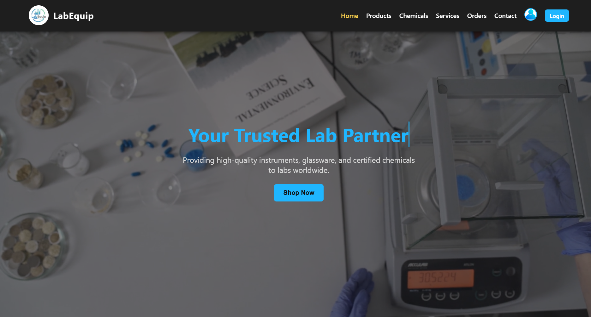

# 🧪 Scientific Lab Equipment Ordering & Management System (Microproject)

## 📌 Overview
The **Scientific Lab Equipment Ordering & Management System** is a real-world, production-ready web application that digitizes and automates the complete workflow of **laboratory equipment ordering, order tracking, cancellation, and admin approval**.

This project is designed for **commercial use**, solves real procurement problems in labs and institutions, and has a **patent application already filed** with the Government.

---

## 🎯 Problem Solved
Traditional lab procurement suffers from:
- Manual order handling
- No centralized tracking
- No cancellation/approval workflow
- Poor user–admin communication
- No role-based access

This system provides a **secure, workflow-driven, role-based digital solution**.

---

## 🚀 Core Features

### 👤 User
- Register & Login
- Browse products and chemicals
- Cart system (works before login using `localStorage`)
- Buy Now → login required → auto-redirect back to cart
- Place orders
- View order history & status
- Cancel orders with reason

### 🛠️ Admin
- Secure admin login
- View **all users’ orders**
- Approve orders
- Update status: **Pending → Dispatched**
- Monitor cancellations
- Centralized order control

---

## 🔄 Workflow Summary

### User Flow
1. Browse products → add to cart (no login needed)
2. Click **Buy Now**
3. Redirected to login if not authenticated
4. After login → redirected back to cart
5. Order placed → stored in database
6. User can track or cancel order

### Admin Flow
1. Admin logs in
2. Views all orders
3. Approves orders
4. Status updates to **Dispatched**
5. Users see updated status instantly

---

## 🧱 System Architecture
- **Frontend:** HTML, CSS, JavaScript
- **Backend:** Python (Flask)
- **Database:** PostgreSQL (Render)
- **Hosting:** Render Cloud
- **Auth:** Flask Sessions

---

## 🗃️ Database Tables
- `register` – user details  
- `orders` – active orders (Pending / Dispatched)  
- `cancelled_orders` – cancelled orders with reason  

---

## 🔐 Security
- Session-based authentication
- Safe redirect handling using `next`
- Role-based access (User / Admin)
- No sensitive frontend storage
- Contact messages sent directly to admin email

---

## ☁️ Deployment
- Backend: Flask (Python)
- Database: PostgreSQL (Render)
- Hosting: Render
- Env variables:
  - `DATABASE_URL`
  - `SECRET_KEY`
  - SMTP credentials

---

## 🧪 Tech Stack
| Layer | Technology |
|------|-----------|
| Frontend | HTML, CSS, JavaScript |
| Backend | Flask (Python) |
| Database | PostgreSQL |
| Hosting | Render |
| Auth | Flask Sessions |

---

## 🧠 Innovation & Value
- Real-world procurement automation
- Complete order lifecycle management
- Admin approval workflow
- Scalable for SaaS & enterprise use

Target users:
- Research labs
- Educational institutions
- Medical & chemical vendors

---

## 🏁 Future Scope
- Online payments
- Inventory management
- Analytics dashboard
- Mobile app
- Multi-admin roles

---

## 👨‍💻 Developer
**Ansh Jaiswal**  
B.Tech CSE(DS) (2nd Year) – Full-Stack Developer  

Built as a **real-world microproject** with **commercial and patent intent**.

---

## 📜 License
This project is protected under intellectual property rights.  
ALong with the government approval copyright and patent with the year of 2026.  
Unauthorized use or redistribution is prohibited, if done then the strict Action will be taken.